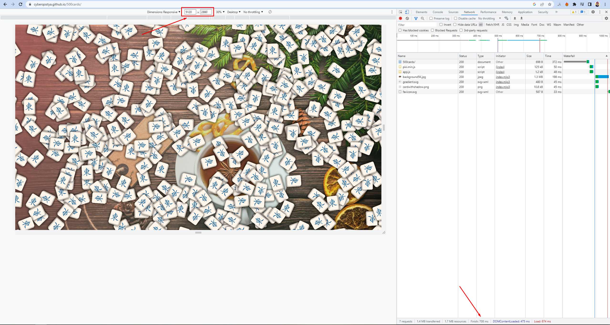
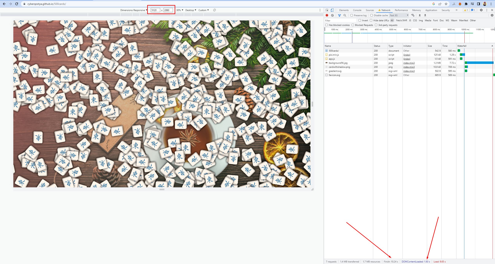
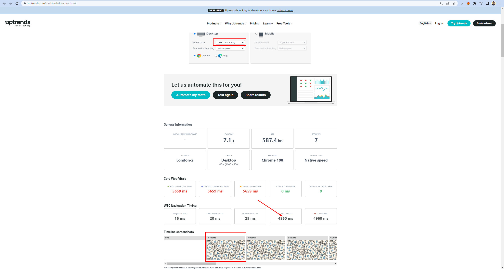
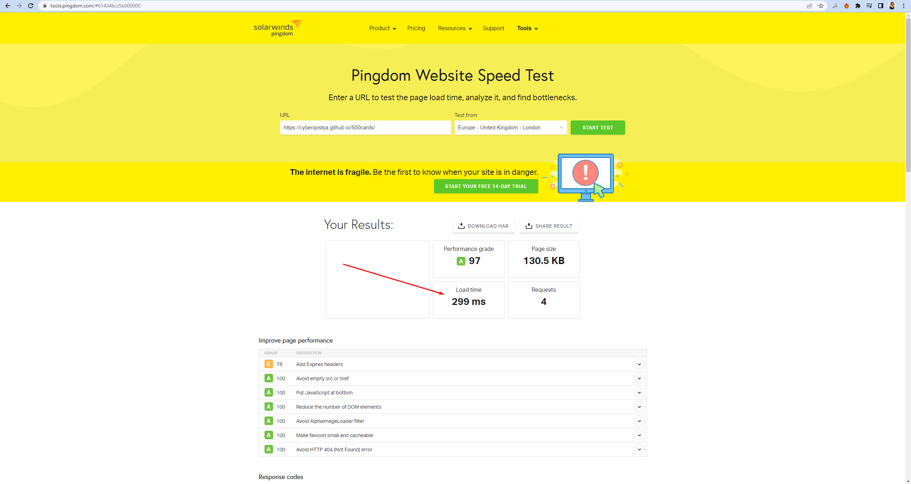
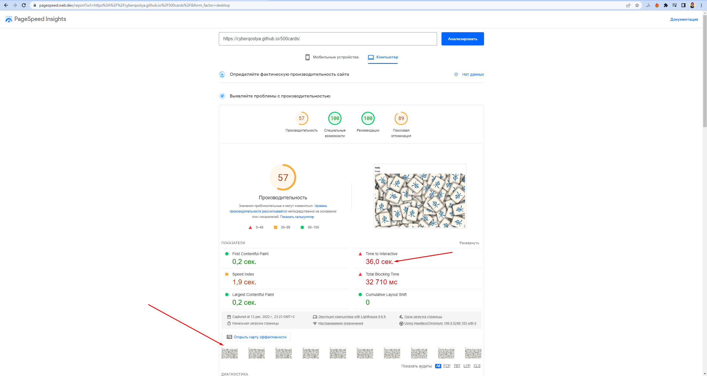

# 500 карточек на PIXI.js

<a href="https://cyberqostya.github.io/500cards/" target="_blank">https://cyberqostya.github.io/500cards/</a>

1. Полный экран 5120\*2880 разрешение
2. 500 карточек png: тень у каждой
3. Размер карточки 300\*300
4. На фоне картинка на весь экран и поверх нее градиент

Выводы:

1. Тень съедает огромное количество ресурсов - заметное торможение.  
   Рисовать тень изначально в картинке - УСПЕХ.
2. Картинки в формате SVG большого размера весят меньше относительно кратинок в PNG и JPG - использовать их по возможности. При малых размерах картинки обратная зависимость.
3. Картинки большого размера лучше иметь в разных разрешениях и отрисовывать в зависимости от размеров экрана пользовательского устройства.
4. Атрибут defer в теге script переносит загрузку скипта в асинхронную часть, не блокируя при этом основной поток (отрисовку DOM). 

Проверка скорости загрузки:

1. Инструменты разработчика, вкладка Network  
   Показатели за 5 перезагрузок страниц в мс с очисткой кеша: 708, 479, 699, 590, 636.  
   Скорость интренета ~91 MBps  
     
   При скорости "Fast 3G" загрузка страницы составила 10,24с, при этом через 1.94с уже происходила анимация карточек и прорисовался градиент фона.  
     
1. [Website Speed Test](https://www.uptrends.com/tools/website-speed-test)  
   Лондон, максимальное разрешение для теста десктопной версии 1600\*900  
   Время загрузки 4.9с  
     
1. [Pingdom Website Speed Test](https://tools.pingdom.com/)  
   Лондон, другие данные неизвестны  
   Время загрузки 299мс  
     
1. [Google PageSpeed Insights](https://pagespeed.web.dev/)  
   К сожалению, при анализе происходит постоянная ошибка "Событие FCP не найдено", вероятнее из-за отсутствия элементов DOM (В данной работе подключаются только скрипты). Поэтому искуственно добавлены теги \<h1\> и \<h2\> для анализа.  
   Время до момента интерактиролвания со страницей целых 36с, при этом индекс скорости всего 1.9с и исходя из карты скриншотов видно, что уже в самом начале загрузки анимация работает.  
     
